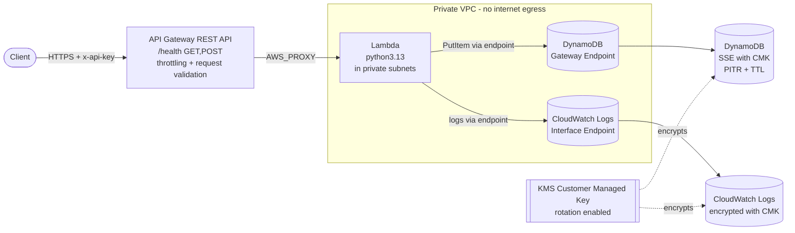

# Architecture

## Overview

The system exposes a single `/health` route through Amazon API Gateway. A
request flows through the gateway (where it is authenticated with an API key,
throttled, and structurally validated) to a Lambda function that runs inside a
private VPC. The function validates the body, writes a structured log entry to
CloudWatch, persists a record to DynamoDB, and returns a JSON status.

## Environments

Two environments, `staging` and `prod`, are produced from a single Terraform
root configuration. They are isolated by Terraform **workspaces** (separate
state) and parameterised by **`.tfvars`** files. Every resource is named with
the `env-resource-name` convention (e.g. `staging-requests-db`,
`prod-health-check-function`).

## Component summary

| Layer        | Service                | Key properties |
|--------------|------------------------|----------------|
| Edge         | API Gateway REST API   | API key auth, usage-plan throttling + quota, request-body validation, access logs |
| Compute      | Lambda (python3.13)    | Private subnets, least-privilege role, reserved concurrency, env-var input validation |
| Data         | DynamoDB               | On-demand billing, SSE with customer-managed KMS key, point-in-time recovery, TTL |
| Encryption   | KMS                    | Customer-managed key, automatic rotation, scoped key policy |
| Network      | VPC                    | Private subnets only, DynamoDB gateway endpoint, Logs interface endpoint, no NAT/IGW |
| Identity     | IAM                    | Separate Lambda execution role and CI deploy role; no wildcard resources except where the AWS API mandates it |
| Delivery     | GitHub Actions         | OIDC (no static keys), scan-before-apply, staging auto-deploy, prod manual approval |

## Trust boundaries

- The only public entry point is the API Gateway HTTPS endpoint.
- The Lambda has **no route to the internet** (no NAT gateway, no internet
  gateway). It reaches AWS services exclusively through VPC endpoints.
- CI authenticates to AWS with short-lived OIDC credentials; there are no
  long-lived AWS access keys stored in GitHub.

See [`docs/adr/`](adr/) for the rationale behind each significant decision.
